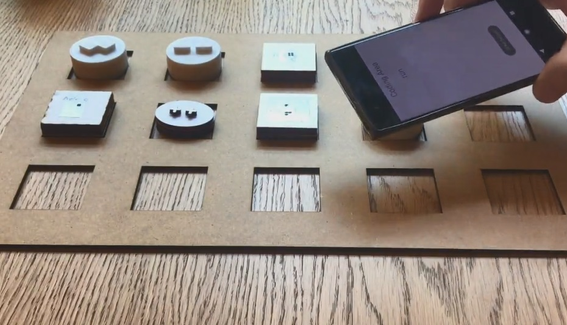

# Budgie Tangible Music Blocks

We developed **Budgie Programming Kit** to teach basics of composing music and programming for children. We developed the system for the students with mixed visual abilities. Visit our [**demo page**](https://asabuncuoglu13.github.io/budgie-tangible-music-kit/demo.html) to quickly see the system capabilities.

## Using Music Blocks
It includes physical blocks to code music with your smartphone. Physical blocks include NFC stickers to be recognized by smartphone. We decided on some pre-defined shapes, you can 3D print, laser cut or use cardbards to replicate these shapes. You can follow the [**print and play**](./notes/print_and_play.md) guide to prepare the tangible blocks.

After preparing the tangible blocks, you can use smartphone application to compose music. To take a detailed look on coding and composing you can use our [**tutorials**](https://asabuncuoglu13.github.io/budgie-tangible-music-kit/tutorial.html) to learn about coding and basics of music theory.

You can find 3D Design Files from link: [Tangible Kit - 3D Design Files](https://drive.google.com/drive/folders/1QtAqzIGH1LJofvgtrSxLd6jc1V5ipldE?usp=sharing) 

## Integrating to the Curriculum
We want to develop a full curriculum with music and code and propose it to Department of Education.

If you want to use Budgie for a workshop, you can use the same structure with our first workshop. The workshop includes three main activities:
- Introducing the physical properties of sound,
- Introducing music theory,
- Introducing coding blocks and composing with algorithm

You can find the workshop document from link: [Workshop 1 Document (in Turkish)](https://docs.google.com/document/d/129qPS7NEnynSaFRjiJ2DTRXET_DdfKEYGRFgwHSheGo/edit?usp=sharing)

We developed the following in-progress curriculum for using Budgie as a one-semester introduction to programming course: [Our Curriculum at Notion](https://www.notion.so/tangiblemusic/6f695bcf80e84f88a0694afdb3da29e8?v=bc15d1b5ccc24b09b39c0d54fac248de)

## Contributing to the Repository
We would like to see all kinds of contributions from students, teachers, developers and inclusive design community. You can support us in various ways:

- Contribute to code: We want to make it available as possible. So, next step will be the iOS application. If you are familiar with native sound libraries of Android and iOS, it would be great to see the contribution to achieve a better sound synthesis. 
- Our curriculum is still in-progress. We would like to see the contribution of educators, musicians, coders and all kind of makers.
- Contribute to design: We conducted some sessions with visually impaired developers and try to understand their interaction with the shapes and mobile phone. But, there might be some other principles which might be adopted to system. We would like to see the contributions of designers and researchers to our project.
- Contribute to translation: We have English and Turkish resources. Translating the documents will be a great support for us.
 
## License

 This work is licensed under a <a rel="license" href="http://creativecommons.org/licenses/by-nc/4.0/">Creative Commons Attribution-NonCommercial 4.0 International License</a>.
