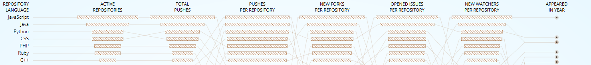

# Javascript Lİbraries for Creative Applications

Javascript (JS) is born as a web development language, but it becomes a common language for general purpose computing. Now, apart from web development purposes, developers use JS in servers, art, game development, mobile applications, machine learning and robotics. Last years, JS becomes has the highest amount of active repositories on GitHub: 

[You can explore and play with the above figure from Githut.](https://githut.info/)

With no suprise, Githut is also coded with Javascript. This is why I have been learning Javascript. I am still learning and probably I will be learning it until I code my last project. It is how learning works, especially if your libraries are updated monthly or yearly. I have started my journey with [Daniel Shiffman](https://shiffman.net/), and you will probably find several examples from his courses or tutorials. After reading this guide, I strongly suggest you to take a look at his website.

So, what is this guide about? Well, I have been teaching courses for six years and I have started to face with similar patterns in the process of learning any kind of coding. Actually, discovering patterns is a major part of computer science and if you are not very familiar what an algorithm is, this was your first lecture. 

This guides aims to present a general map of the libraries and other resources, to use Javascript Libraries in creative applications with visual manipulation, audio processing, machine learning and augmented reality.