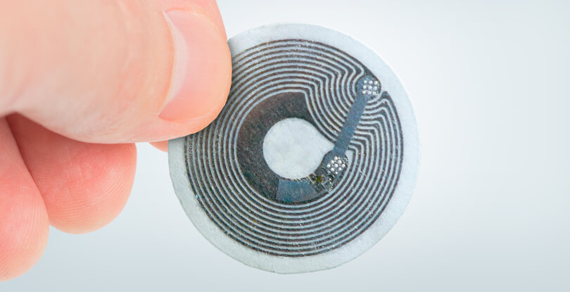

# Print and Play Guide

## Summary
1. Find 20 pieces of NTAG (NFC Stickers)
2. Write pre-defined text to NFC-stickers with an NFC Utilization tool
3. Prepare your blocks with your favorite material
4. Download Budgie App
5. Start coding


## 1. Find 20 pieces of NTAG

```
NTAG: NFC tags/stickers are passive devices, which means that they operate without a power supply of their own and are reliant on an active device to come into range before they are activated. These devices can’t really do any processing of their own, instead they are simply used to transfer information to an active device, such as a smartphone. 
```



If you prefer to run Budgie Music Kit with the physical blocks, you will need NFC stickers. You can find them from your local or online robotic/electronic store. 

To reference, I share the Amazon Search with "NFC Stickers" screenshot:


## 2. Write pre-defined text to NFC-stickers with an NFC Utilization tool

When you download "Budgie" to your NFC-supported device, the app can recognize the NFC-stickers. But, first you need to write the following pre-defined text with an NFC-Utilization Tool. I am using [NFC Tools](https://play.google.com/store/apps/details?id=com.wakdev.wdnfc) in my phone, you can pick your favorite app from your phone's marketplace.

The tags should be written with the following texts:

```
Block Name = NFC Text
----------   --------

* START = "start";
* LOOP = "loop";
* ADD_NOTE_A = "notea";
* ADD_NOTE_B = "noteb";
* ADD_NOTE_C = "notec";
* ADD_NOTE_D = "noted";
* ADD_NOTE_E = "notee";
* ADD_NOTE_F = "notef";
* ADD_NOTE_G = "noteg";
* ADD_NOTE_NULL = "notenull";
* LOW_FREQ = "freqlow";
* HIGH_FREQ = "freqhigh";
* BPM = "bpm";
* MEASURE = "measure";
* KICK = "kick";
* GUITAR_SOUND = "guitar";
* PIANO_SOUND = "piano";
* SINE_WAVE = "sinewave";
* SQUARE_WAVE = "squarewave";
* RUN = "run";
* SPEAK = "info";
* SAVE = "save";

```

## 3. Prepare your blocks with your favorite material

We shared the 3D Print and Laser-Cut models in our Drive Folder: [Tangible Kit - 3D Design Files](https://drive.google.com/drive/folders/1QtAqzIGH1LJofvgtrSxLd6jc1V5ipldE?usp=sharing) If you are not familiar with these technologies, you can simply use any carboard or play-dough to model the shapes and place the NFC in them. You can simply see our web demo to check the shapes or be creative and make your own shapes!

## 4. Download Budgie App

Budgie app is only available for Android phones (for now.) You can download the app from: [Google Play Store - Budgie Music Programming](https://play.google.com/store/apps/details?id=com.alpay.twinmusic&hl=en)


## 5. Start Coding

Tap the START block with your device and start coding! You can follow our [Tutorials](https://budgi.es/tutorial.html) to learn more about music and programming.

